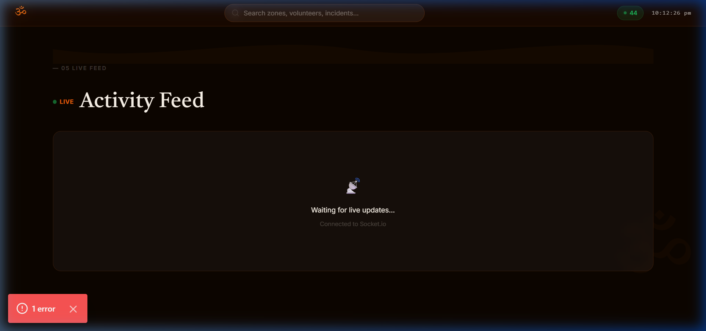
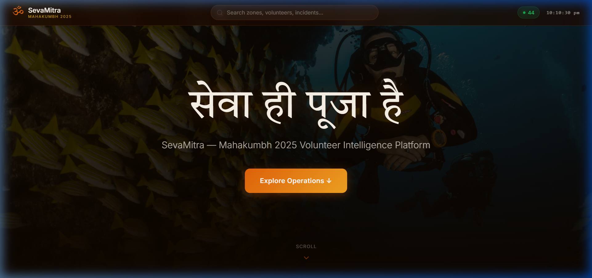

# ॐ SevaMitra — Volunteer Management System

SevaMitra is a comprehensive, real-time Volunteer Management System specifically designed and built for **Mahakumbh 2025**. It is capable of intelligently handling over 10,000 volunteers across 20+ zones to ensure a safe and organized event for millions of attendees.

## 🌟 What Makes SevaMitra Unique & Helpful?

SevaMitra goes beyond a traditional CRUD application by serving as a **Real-time Operations Center**. During a massive event like the Mahakumbh, seconds matter. SevaMitra is uniquely designed to solve on-the-ground challenges:

* **Instant Awareness:** Leveraging real-time Socket.io connections, the activity feed, incident reports, and zone capacity levels update instantaneously across the dashboard.
* **Smart Allocation Engine:** Instead of manually assigning tasks, the system features a "Find Best Volunteers" engine that scores available volunteers based on a custom algorithm matching **skills**, **distance**, **current availability**, and **historical reliability score**. 
* **Cultural Aesthetic:** The application doesn't look like generic enterprise software. It adopts a custom "Premium Light Theme" featuring Saffron (`#FF6B00`), Gold (`#D4A017`), and Deep Brown (`#1C0A00`), complete with an OM watermark (`ॐ` in Tiro Devanagari Sanskrit) and curated imagery of sacred moments, bringing the spirit of the event into the software.

## ♿ Designed for Accessibility (Older Age Friendly)

Many esteemed organizers and senior administrative staff managing the Mahakumbh belong to an older demographic. SevaMitra is heavily optimized for them:

* **Larger Typography:** Employs large, highly readable fonts (Poppins and Inter) with increased base font sizes (16px minimum, often larger). Text weights are optimized for readability.
* **High Contrast UI:** The stark contrast between the warm cream backgrounds (`#FFF8F0`) and the dark brown text (`#1A0A00`) significantly reduces eye strain.
* **Large Interactive Elements:** Buttons, form fields, and navigation links have been given ample padding (`min-height: 48px/52px`) to provide large click/tap targets, reducing precision requirements.
* **Clear Visual Indicators:** Uses universally understood, color-coded badges (Green, Orange, Red) and emojis for immediate visual processing of priorities, rather than relying solely on text. 

## 🚀 Key Features

* **Live Operations Dashboard:** A centralized command center displaying live metrics (active volunteers, zones over capacity, open incidents), zone status overviews, and an auto-updating activity feed.
* **Zone Capacity Tracking:** Visual progress bars track the capacity of critical zones (Ghats, Camps, Medical, Traffic) to prevent dangerous overcrowding.
* **Incident Management System:** Real-time reporting and resolution of incidents, complete with severity levels and one-click "Deploy Volunteers" functionality.
* **Reports & Analytics:** Deep insights into event performance, including average incident response times and a competitive **Volunteer Leaderboard** showcasing the top 10 most reliable volunteers with rank badges.
* **Volunteer App Login:** A streamlined, OTP-based (simulated) mobile-first login experience for volunteers on the ground.
* **Automated Quick Allocation:** Matches urgent tasks to the closest and most qualified volunteers instantly.

## 📸 Platform Interface


*The immersive Mahakumbh 2025 themed landing experience*


*Real-time capacity tracking across all managed event zones*

## 💻 Tech Stack

* **Frontend:** Next.js 14 (App Router), React, Tailwind CSS (Custom "Premium Light Theme"), Vanilla CSS animations (for high-performance scroll reveals without layout thrashing)
* **Backend:** Node.js + Express
* **Database:** PostgreSQL (with Prisma ORM)
* **Real-time Engine:** Socket.io
* **Caching:** Redis

## 🛠️ Setup Instructions

### Prerequisites
* Node.js (v14 or higher)
* Docker
* PostgreSQL
* Redis

### Installation & Running

1. **Clone the repository:**
   ```bash
   git clone <repository-url>
   cd SevaMitra
   ```

2. **Install dependencies:**
   ```bash
   cd apps/api && npm install
   cd ../web && npm install
   ```

3. **Environment Setup:**
   * Copy `.env.example` to `.env` in the respective folders and fill in the required values.

4. **Start Infrastructure:**
   ```bash
   docker-compose up
   ```

5. **Database Setup:**
   ```bash
   npx prisma migrate dev
   ```

6. **Start the Applications:**
   ```bash
   # Terminal 1: Start API
   cd apps/api
   npm run dev

   # Terminal 2: Start Web App
   cd apps/web
   npm run dev
   ```

## 🛡️ Code Quality
* ESLint and Prettier configured.
* Husky pre-commit hooks enabled for strict code quality enforcement before commits.

## 📄 License
This project is licensed under the MIT License.