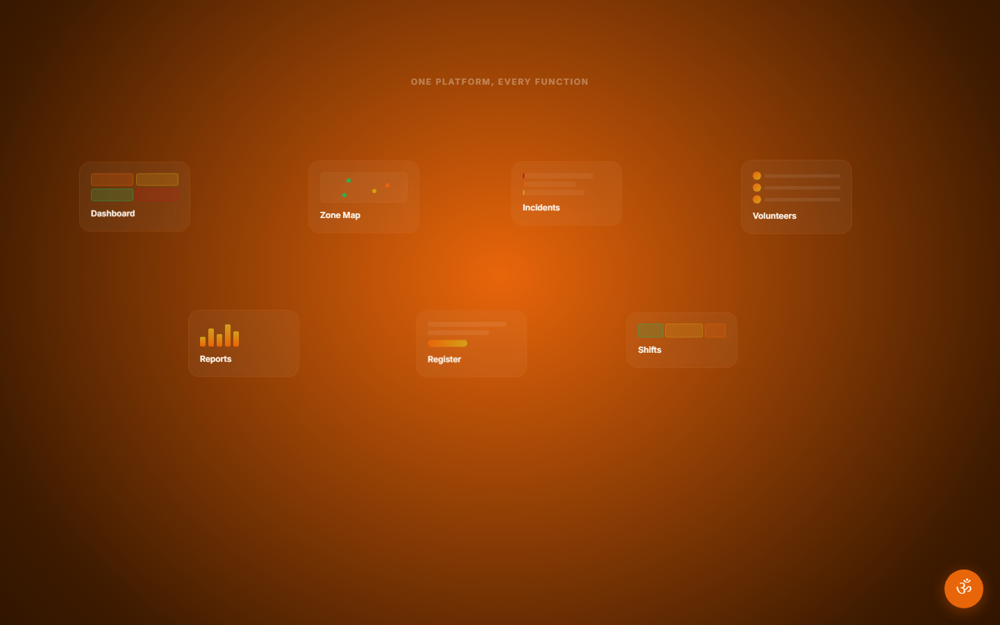
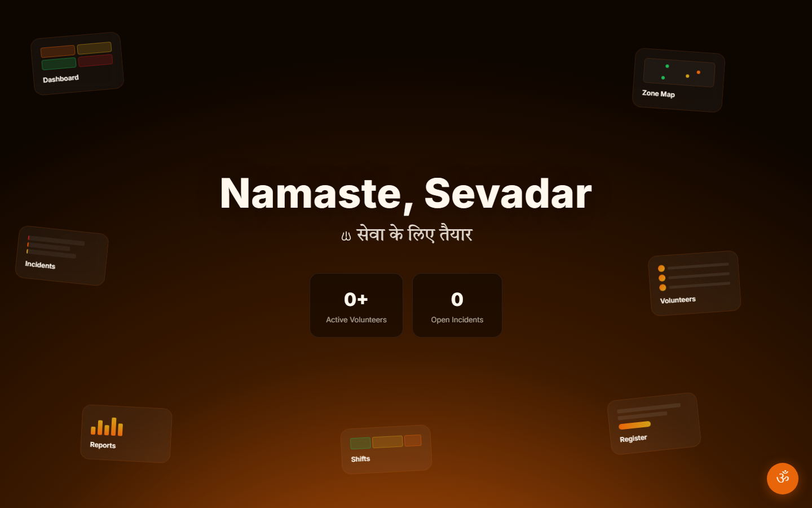
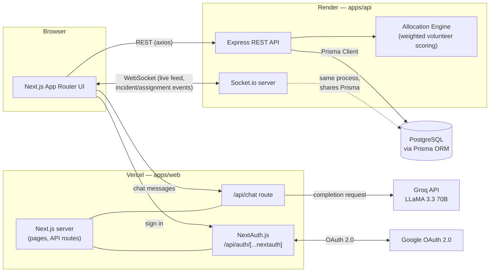
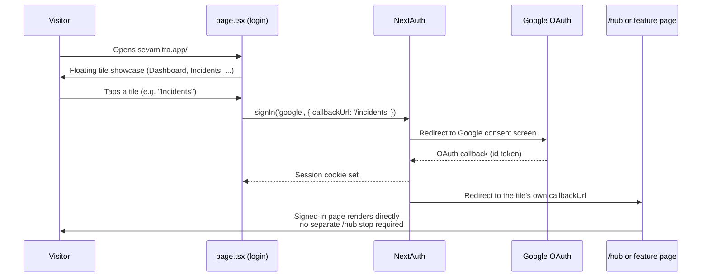

<div align="center">

# SevaMitra

**<a href="https://seva-mitra-wheat.vercel.app/">Live Demo</a>** · Real-time volunteer coordination platform for Mahakumbh 2025

> The live demo's backend is on a free-tier host, so the database may take 5-10 seconds to wake up on first load. If data doesn't appear immediately, reload after a few seconds.

[](https://github.com/devaskswhy/SevaMitra/actions/workflows/ci.yml)


</div>

## About

SevaMitra is a command platform for coordinating volunteer operations at high-density pilgrimage events. It gives coordinators live zone intelligence, incident deploy workflows, shift scheduling, and an AI assistant, all backed by a real-time Socket.io layer so every connected dashboard stays in sync.

Signed-out visitors land on a floating-tile showcase of every function in the platform; tapping any tile signs them in with Google and takes them straight to that page (see [Auth flow](#auth-flow) below).



## Features

| Feature | What it does |
|---|---|
| Zone Map | Interactive Leaflet.js map for zone-level situational awareness. |
| Zone Status | Real-time capacity tracking with severity states: Low / Medium / High / Critical. |
| Incident Tracker | Handles incidents like Medical Emergency, Crowd Surge, and Lost Person, with a one-click deploy workflow that scores and assigns the best available volunteer. |
| Volunteer Directory | Searchable volunteer roster with skills and reliability scores. |
| Shift Scheduling | Admin UI for scheduling shifts with double-booking conflict detection. |
| Live Feed | Instant activity stream powered by Socket.io. |
| SevaSahayak AI | In-app Groq LLaMA 3.3 70B assistant with bilingual Hindi-English guidance. Degrades to a canned response if no `GROQ_API_KEY` is configured — see [Running without real infra](#running-without-real-infra). |



<sub>The signed-in hub: the same floating-tile showcase, now personalized with live stats, that converges into a settled row as you scroll.</sub>

## Dashboards

| Zone Status Overview | Mahakumbh Zone Intelligence Map |
|---|---|
|  |  |

## Incident Tracker


<sub>Deploying a volunteer runs the allocation-scoring algorithm live — see the <a href="./docs/case-study-allocation-engine.md">case study</a> for how it works.</sub>

## Volunteer Directory


## SevaSahayak — AI in Action

| Crowd Avoidance Query | Nearest Medical Camp Query |
|---|---|
|  |  |

## Tech Stack

| Layer | Tech | Purpose |
|---|---|---|
| Frontend | Next.js 14 (App Router), React, Tailwind CSS | Command UI and dashboard experience |
| Animation & Scroll | GSAP, Lenis | Scroll-linked floating-tile convergence, parallax hero |
| Mapping | Leaflet.js, React-Leaflet | Zone visualization |
| Auth | NextAuth.js, Google OAuth | Coordinator/admin sign-in |
| Backend | Node.js, Express | REST API, business logic, allocation engine |
| Realtime | Socket.io | Live activity feed and cross-dashboard sync |
| Database | PostgreSQL, Prisma ORM | Structured operational data |
| AI Assistant | Groq API + LLaMA 3.3 70B | SevaSahayak conversational assistant |
| Testing | Jest, Supertest, ts-jest | Unit + integration tests for `apps/api` |
| CI | GitHub Actions | Lint/build for `apps/web`, typecheck/test for `apps/api` |

## Architecture


```mermaid
flowchart LR
    subgraph Browser
        UI["Next.js App Router UI"]
    end

    subgraph Vercel["Vercel — apps/web"]
        NextJS["Next.js server<br/>(pages, API routes)"]
        NextAuth["NextAuth.js<br/>/api/auth/[...nextauth]"]
        ChatRoute["/api/chat route"]
    end

    subgraph Backend["Render — apps/api"]
        Express["Express REST API"]
        AllocEngine["Allocation Engine<br/>(weighted volunteer scoring)"]
        SocketIO["Socket.io server"]
    end

    DB[("PostgreSQL<br/>via Prisma ORM")]
    Groq["Groq API<br/>LLaMA 3.3 70B"]
    Google["Google OAuth 2.0"]

    UI -- "REST (axios)" --> Express
    UI <-->|"WebSocket (live feed,<br/>incident/assignment events)"| SocketIO
    UI -- "sign in" --> NextAuth
    NextAuth <-->|"OAuth 2.0"| Google
    UI -- "chat messages" --> ChatRoute
    ChatRoute -- "completion request" --> Groq

    Express --> AllocEngine
    Express -- "Prisma Client" --> DB
    SocketIO -.->|"same process,<br/>shares Prisma"| DB

    NextJS --- NextAuth
    NextJS --- ChatRoute
```

### Auth flow

Coordinator/admin sign-in is Google OAuth via NextAuth.js — a separate persona from the volunteer phone+OTP flow under `apps/web/app/volunteer/**`.


```mermaid
sequenceDiagram
    participant V as Visitor
    participant L as page.tsx (login)
    participant NA as NextAuth
    participant G as Google OAuth
    participant H as /hub or feature page

    V->>L: Opens sevamitra.app/
    L->>V: Floating tile showcase (Dashboard, Incidents, ...)
    V->>L: Taps a tile (e.g. "Incidents")
    L->>NA: signIn('google', { callbackUrl: '/incidents' })
    NA->>G: Redirect to Google consent screen
    G-->>NA: OAuth callback (id token)
    NA-->>L: Session cookie set
    NA->>H: Redirect to the tile's own callbackUrl
    H->>V: Signed-in page renders directly —<br/>no separate /hub stop required
```

`middleware.ts` gates every coordinator route (`/hub`, `/dashboard`, `/incidents`, `/volunteers`, `/reports`, `/register`, `/map`, `/shifts`) behind this session; visiting any of them unauthenticated redirects back to `/`.

## Getting Started

### Prerequisites
- Node.js 20+
- Docker (for local Postgres) — or point `DATABASE_URL` at any Postgres instance you already have

### 1. Clone and install

```bash
git clone https://github.com/devaskswhy/SevaMitra.git
cd SevaMitra

npm install                 # root (Prisma CLI)
cd apps/api && npm install  # backend
cd ../web && npm install    # frontend
cd ../..
```

### 2. Start Postgres

```bash
docker-compose up -d
```

This brings up Postgres (and Redis, reserved for future use) with healthchecks — no other setup required.

### 3. Push the schema and seed demo data

```bash
npx prisma generate --schema=./prisma/schema.prisma
npx prisma db push --schema=./prisma/schema.prisma
npx prisma db seed --schema=./prisma/schema.prisma
```

This creates 10 zones, 50 volunteers, 10 shifts, 20 tasks, 30 assignments, and 20 incidents — enough realistic data to exercise every dashboard.

### 4. Configure environment variables

```bash
cp apps/api/.env.example apps/api/.env
cp apps/web/.env.example apps/web/.env.local
```

`apps/api/.env.example` and `apps/web/.env.example` are both fully commented — fill in `apps/api/.env`'s `DATABASE_URL` to match your Postgres (the docker-compose default is already correct), and see [Running without real infra](#running-without-real-infra) for what's optional in `apps/web/.env.local`.

### 5. Run both apps

```bash
# Terminal 1
cd apps/api && npm run dev

# Terminal 2
cd apps/web && npm run dev
```

Open `http://localhost:3001` (Next.js falls back to 3001 if 3000 is taken). You'll see the reframed login page and can browse it fully — reaching the hub and feature pages additionally requires your own Google OAuth credentials (see below).

## Running without real infra

Everything above works with zero external services except Postgres. Specifically:

- **`GROQ_API_KEY` unset** — the SevaSahayak chat widget still responds, with a canned demo-mode message instead of a live completion (`apps/web/app/api/chat/route.ts`). No network call is made.
- **Google OAuth not configured** — the login page, its floating showcase, and the whole visual redesign render and are fully interactive. What you *can't* do without real `GOOGLE_CLIENT_ID`/`GOOGLE_CLIENT_SECRET`/`NEXTAUTH_SECRET` credentials (see `apps/web/.env.example` for how to get them from Google Cloud Console) is actually complete the sign-in and reach `/hub` or any gated feature page. This is a genuine limitation, not hidden: a stranger cloning this repo can see and evaluate the entire pre-login experience in minutes, but needs their own OAuth client to go further.
- **Redis** — provisioned by `docker-compose.yml` for future use; nothing in the current codebase depends on it yet.

## Testing

```bash
cd apps/api
npm test
```

Runs against a real Postgres (matching `docker-compose.yml`'s credentials by default, via `.env.test` — **not** `.env`, which is where local setups keep production credentials, so the test suite can never accidentally touch a live database). Covers:

- **Unit tests** — `allocationEngine.ts`'s pure scoring functions (skills match, reliability, proximity), including the crude proximity heuristic's actual edge-case behavior.
- **Integration tests** — `POST /api/incidents/:id/deploy` and `POST /api/allocation/recommendations` against a real database, written to stay correct whether run against an empty DB or one already full of seeded demo data.

```bash
cd apps/web
npm run lint
npm run build
```

CI (`.github/workflows/ci.yml`) runs all of the above on every push and PR to `master`.

## Case Study

[docs/case-study-allocation-engine.md](./docs/case-study-allocation-engine.md) — how the weighted volunteer-scoring algorithm works, and an honest limitation: the location-proximity score is a crude state-name string match, not real geodistance.

## Roadmap

- Replace the proximity score's state-name matching with real lat/lng-based geodistance (see case study).
- Harden production observability and incident analytics.
- Expand multilingual support and voice-assisted SevaSahayak flows.

---

<div align="center">


**Made for Mahakumbh 2025.** If this project is useful to you, consider starring it.

</div>
